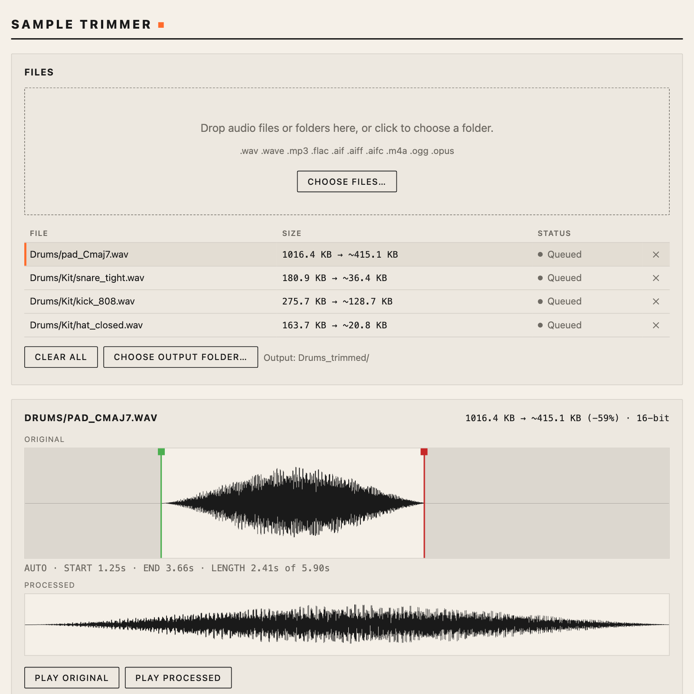
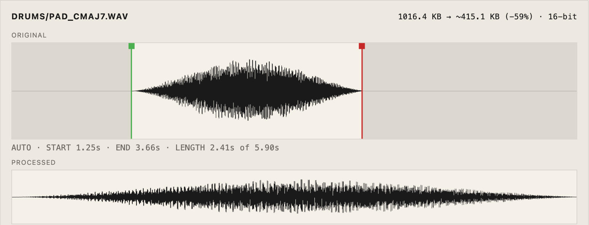
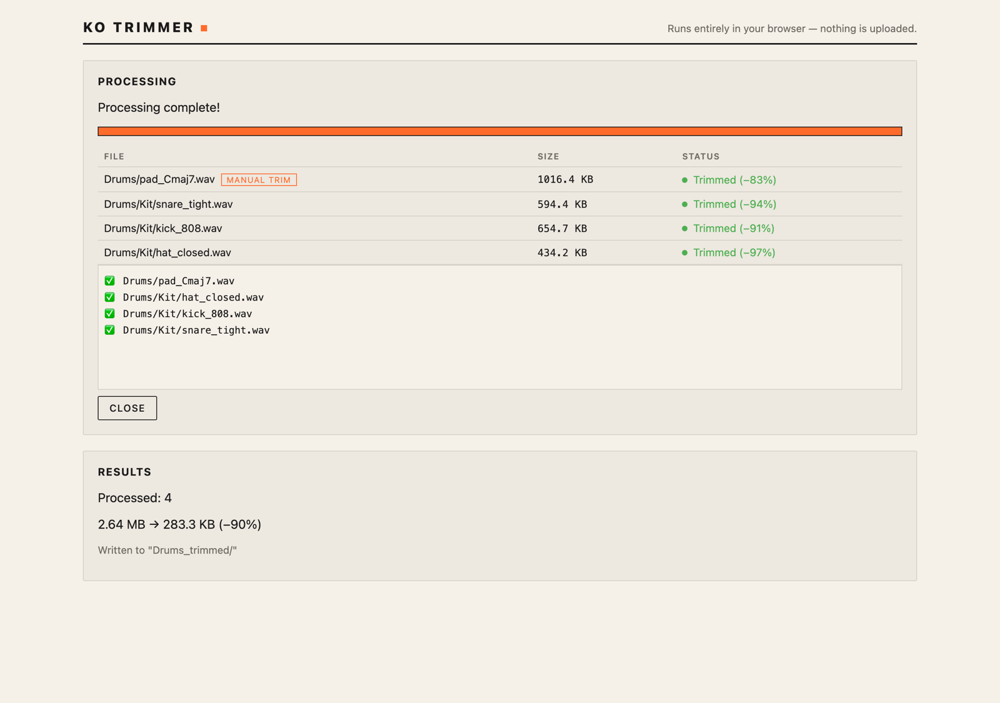

# KO Trimmer

Batch silence-trimmer for beatmakers with limited sample storage on hardware devices
(Teenage Engineering OP-1/OP-Z/EP series, Pocket Operators, MPC). Trims silence from the
start and end of every sample in a folder, with optional mono downmix, bitrate/sample-rate
reduction, and tape-style speed-up to squeeze samples into tight device memory.

**Use it at [alexthescott.github.io/KO-Trimmer](https://alexthescott.github.io/KO-Trimmer/)** —
installable from Chrome, works offline, no download or FFmpeg required. All audio
processing and file reading/writing happens locally in your browser.



## How to use

1. **Add samples.** Drop audio files or a folder onto the app, or click to choose a folder.
   Every supported sample in it (including subfolders) is queued. Favorite folders can be
   saved in the sidebar for quick access.
2. **Adjust settings.** Silence threshold, minimum silence duration, padding, speed-up,
   bitrate, and preserve-stereo (off = mono downmix).
3. **Check the trim.** Selecting a file opens the waveform editor: the green and red handles
   show where leading and trailing silence will be cut. Drag them to override the automatic
   trim for that file (double-click a handle to revert to auto). Press Space to preview, and
   the editor shows the estimated output size.

   

4. **Process.** Click **Process Files** to run the batch. In Chrome, trimmed files are written
   into a `<folder>_trimmed/` subfolder (or use **Choose output folder…** to pick another
   location); in other browsers they download as a ZIP. Enable **Overwrite original** (Chrome only) to
   replace the original files in place.

   

MP3 inputs stay MP3; everything else is written as WAV. Files longer than 20 seconds after
processing get an underscore (`_`) prefix for KO II compatibility.

See [`web/README.md`](web/README.md) for development and deployment instructions.

## Development

Vanilla TypeScript + Vite, no UI framework.

```bash
npm install
npm run dev        # local dev server
npm test           # unit tests (Vitest)
npm run build      # typecheck + production build to dist/
npm run preview    # serve dist/ locally at the /KO-Trimmer/ base path
npm run icons      # regenerate PWA icons from assets/Knockout.svg
```

Unit tests cover the pure DSP logic (energy envelope, silence detection, leading+trailing
trim, naming rules, speed-up resampling, size estimates, and an MP3 encoder smoke test).
Browser-only behavior (File System Access API, drag-drop, service worker, playback) isn't
covered. Run `npm test` before changing anything under `src/audio/`.

### Deploy

Pushing to `main` triggers `.github/workflows/deploy-pwa.yml`, which tests, builds, and
deploys `dist/` to GitHub Pages. One-time setup: Settings → Pages → source = "GitHub
Actions". The production base path is `/KO-Trimmer/` (`vite.config.ts`); change `base` to
`/` if moving to a custom domain.

### Browser support

Full functionality (true in-place overwrite, writing output directly into a folder,
persisted favorite folders) requires Chrome's File System Access API. Other browsers get a
degraded-but-functional tier: a `<input webkitdirectory>` folder picker and a ZIP download.

## License

MIT
